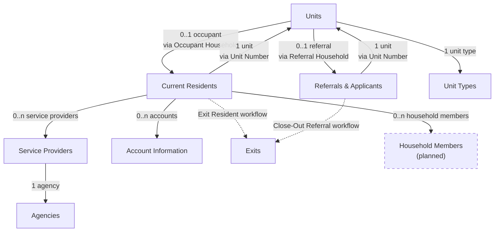

---
{"dg-publish":true,"permalink":"/03-data-model/","dgShowToc":true}
---

# Data Model

**SharePoint Lists - Schema & Relationships**

All UP Clearview data is stored in SharePoint Online lists. This document describes each list's purpose, key fields, and relationships.

---

## Entity Relationship Diagram (v0.85)



---

## Core Data Lists

### Units
**Purpose:** Housing unit inventory with eligibility requirements and current status

**Key Fields:**
- **Title** (Text) - Unit number/identifier
- **Unit Type** (Lookup to Unit Types) - Links to eligibility template
- **Is occupied** (Yes/No) - Current occupancy status
- **Has given notice** (Yes/No) - Resident planning to move out
- **Has referral** (Yes/No) - Referral assigned to this unit
- **Has move-in scheduled** (Yes/No) - Move-in date set
- **Is offline** (Yes/No) - Unit temporarily unavailable
- **Occupant Household** (Lookup to Current Residents) - Current resident
- **Referral Household** (Lookup to Referrals & Applicants) - Assigned referral
- **Referral Requested** (Date) - When referral was requested
- **Date Available** (Date) - When unit became/will become available
- **HMIS Program ID** (Text) - External system identifier
- **Referral Source** (Text) - Where referrals come from for this unit
- **Administrator** (Text) - Responsible party

**Relationships:**
- → Current Residents (one-to-one via Occupant Household)
- → Referrals & Applicants (one-to-one via Referral Household)
- → Unit Types (many-to-one)

**Used By:** [UnitBrowseScreen](screens/07a-UnitBrowseScreen.md), [UnitInfoScreen](screens/07d-UnitInfoScreen.md), all workflows

---

### Current Residents
**Purpose:** Active resident records with demographics and service connections

**Key Fields:**
- **Title** (Text) - Resident name (Last, First or First Last)
- **Household Status** (Choice) - Current status (e.g., "Occupant, Current", "Former Occupant")
- **Unit Number** (Lookup to Units) - Assigned unit
- **Associated Providers** (Lookup to Service Providers, multi-select) - Connected service providers
- **Lease Signing Date** (Date) - Move-in date
- **Expected Move Out** (Date) - Planned move-out date
- **Preferred Name** (Text)
- **Preferred Language** (Text)
- **Date of Birth** (Date)
- **Phone** (Text)
- **Email** (Text)
- **Veteran Status** (Choice) - e.g., "Veteran", "Not a Veteran"
- **Disability** (Choice) - Yes/No or type
- **Benefits** (Text) - SSI, SSDI, etc.
- **Other Source of Income** (Text)
- **Monthly Income** (Number/Currency)
- **HMIS Record Number** (Text)
- **County Case Number** (Text)
- **Household Size** (Number)

**Relationships:**
- → Units (many-to-one via Unit Number)
- ← Units (one-to-one reverse via Occupant Household)
- → Service Providers (many-to-many via Associated Providers)
- → Account Information (one-to-many)
- → Household Members (one-to-many) - *Planned, not yet implemented*

**Used By:** [ResBrowseScreen](screens/07c-ResBrowseScreen.md), [ResInfoScreen](screens/07f-ResInfoScreen.md), [scrResidentAssociations](screens/07j-scrResidentAssociations.md), [Exit Resident workflow](workflows/08e-Exit-Resident.md)

---

### Referrals & Applicants
**Purpose:** Referral and applicant pipeline tracking

**Key Fields:**
- **Title** (Text) - Applicant/referral name
- **Household Status** (Choice) - Current stage (e.g., "Referral, Received", "Applicant, Approved", "Former Referral")
- **Unit Number** (Lookup to Units) - Assigned unit
- **Date Referred** (Date) - When referral received
- **Intake Completed** (Date) - When intake was completed
- **Phone** (Text)
- **Email** (Text)
- **Preferred Name** (Text)
- **Preferred Language** (Text)
- **Date of Birth** (Date)
- **Veteran Status** (Choice)
- **Disability** (Choice)
- **Benefits** (Text)
- **Other Source of Income** (Text)
- **Monthly Income** (Number/Currency)
- **HMIS Record Number** (Text)
- **County Case Number** (Text)
- **Household Size** (Number)

**Relationships:**
- → Units (many-to-one via Unit Number)
- ← Units (one-to-one reverse via Referral Household)

**Used By:** [RNABrowseScreen](screens/07b-RNABrowseScreen.md), [RNAInfoScreen](screens/07e-RNAInfoScreen.md), [IntakeScreen](screens/07h-IntakeScreen.md), [scrConvert](screens/07g-scrConvert.md), [RNACloseScreen](screens/07i-RNACloseScreen.md)

**Workflow Transitions:**
- [Receive Referral](workflows/08a-Receive-Referral.md) → Creates record
- [Phone Screening](workflows/08b-Phone-Screening.md) → Updates record
- [Intake](workflows/08c-Intake.md) → Updates record, advances status
- [Convert to Resident](workflows/08d-Convert-to-Resident.md) → Transfers to Current Residents, deletes referral
- [Close-Out](workflows/08f-Close-Out-Referral.md) → Archives to Exits, deletes referral

---

### Unit Types
**Purpose:** Eligibility requirement templates for different unit types

**Key Fields:**
- **Title** (Text) - Unit type name (e.g., "LTH Housing Support", "Ramsey CoC")
- **Income Restriction** (Choice or Text) - e.g., "30% AMI", "50% AMI"
- **Maximum Income Limit** (Number/Currency) - Dollar amount
- **Occupancy Requirement** (Text) - Who can occupy
- **Homelessness Requirement** (Yes/No or Choice) - Must be experiencing homelessness?
- **Disability Requirement** (Choice) - e.g., "None", "Physical", "Mental Health", "Either"
- **Disability Documentation** (Text) - What documentation required
- **Specific Eligibility Requirements** (Multi-line Text) - Additional details

**Relationships:**
- ← Units (one-to-many)

**Used By:** [IntakeScreen](screens/07h-IntakeScreen.md) (displays requirements), [UnitInfoScreen](screens/07d-UnitInfoScreen.md) (eligibility section)

---

### Exits
**Purpose:** Exit and close-out logging for historical tracking and reporting

**Status:** ✅ Fully implemented (October 24, 2025)

**Key Fields:**
- **Title** (Text) - Person's name
- **Stage** (Choice) - "Resident", "Applicant", or "Referral"
- **Exit / Close-Out Date** (Date) - When they exited/closed out
- **Close-Out Reason** (Choice) - Reason for exit (optional, populated for referrals)
- **Notes** (Multi-line Text) - Additional details (optional)

**Relationships:** None (archive only)

**Created By:**
- [Exit Resident workflow](workflows/08e-Exit-Resident.md)
- [Close-Out Referral workflow](workflows/08f-Close-Out-Referral.md)

**Used For:**
- Historical reporting
- Turnover analysis
- Future ETO integration
- Audit trails

---

## Service Provider & Organization Lists

### Service Providers
**Purpose:** Case manager and service provider directory

**Key Fields:**
- **Title** (Text) - Provider name
- **Role/Title** (Text) - Job title or role
- **Organization** (Lookup to Agencies) - Affiliated organization
- **Program** (Text) - Program or department
- **Phone** (Text)
- **Email** (Text)
- **Is Active** (Yes/No) - Currently active provider?

**Relationships:**
- → Agencies (many-to-one via Organization)
- ← Current Residents (many-to-many reverse via Associated Providers)

**Used By:** [scrServiceProviders](screens/07m-scrServiceProviders.md), [scrResidentAssociations](screens/07j-scrResidentAssociations.md)

---

### Agencies
**Purpose:** Organizations providing services

**Key Fields:**
- **Title** (Text) - Organization name
- **Contact Person** (Text)
- **Phone** (Text)
- **Email** (Text)
- **Services Provided** (Multi-line Text) - Description of services
- **Service Providers** (Lookup to Service Providers, multi-select) - Staff from this organization

**Relationships:**
- ← Service Providers (one-to-many)

**Used By:** [OrgScreen](screens/07l-OrgScreen.md), [scrServiceProviders](screens/07m-scrServiceProviders.md)

---

### Account Information
**Purpose:** Bill pay tracking for Housing Support program

**Key Fields:**
- **Title** (Text) - Account name/description
- **Associated Resident** (Lookup to Current Residents) - Who this account is for
- **Account Provider** (Choice) - e.g., "Excel Energy", "CenterPoint", "Xcel Energy"
- **Username** (Text) - Login username
- **Account Number** (Text) - Provider account number
- **Is Payable Account** (Yes/No) - Is this a bill-pay account?
- **Billing Frequency** (Choice) - e.g., "Monthly", "Quarterly"
- **Recurring Cost** (Number/Currency) - Expected monthly/regular charge
- **Is Active** (Yes/No) - Currently active account?

**Relationships:**
- → Current Residents (many-to-one via Associated Resident)

**Used By:** [scrResidentAccounts](screens/07k-scrResidentAccounts.md), [scrResidentAssociations](screens/07j-scrResidentAssociations.md)

**Security Note:** Password field should be removed. Users should use browser-built password managers instead.

---

### Household Members
**Purpose:** Track household composition (family members)

**Status:** ⚠️ Planned, not yet implemented

**Proposed Fields:**
- **Title** (Text) - Member name
- **Associated Resident** (Lookup to Current Residents) - Head of household
- **Relationship** (Choice) - e.g., "Spouse", "Child", "Parent", "Other"
- **Date of Birth** (Date)
- **Notes** (Multi-line Text) - Additional information

**Relationships:**
- → Current Residents (many-to-one via Associated Resident)

**Will Be Used By:** [scrResidentAssociations](screens/07j-scrResidentAssociations.md) (household members section)

---

## Lookup Relationships Summary

### Bidirectional Lookups (Maintained by App Workflows)

**Units ↔ Current Residents:**
- Units.'Occupant Household' → Current Residents
- Current Residents.'Unit Number' → Units
- **Note:** Power App workflows maintain both sides of this relationship

**Units ↔ Referrals & Applicants:**
- Units.'Referral Household' → Referrals & Applicants
- Referrals & Applicants.'Unit Number' → Units
- **Note:** Power App workflows maintain both sides of this relationship

### One-Way Lookups

**Units → Unit Types:**
- Units.'Unit Type' → Unit Types
- Simple lookup, no reverse relationship needed

**Current Residents → Service Providers (Multi-Select):**
- Current Residents.'Associated Providers' → Service Providers (multiple)
- No reverse lookup

**Service Providers → Agencies:**
- Service Providers.'Organization' → Agencies
- Agencies.'Service Providers' is reverse multi-select (manually maintained)

**Account Information → Current Residents:**
- Account Information.'Associated Resident' → Current Residents
- No reverse lookup (can filter accounts by resident)

---

## Field Type Handling in Power Apps

### Choice Fields
Choice fields in SharePoint require special handling in Power Apps:

```powerapps
// Setting a choice field
Patch(List, Item, {
    ChoiceField: {
        '@odata.type': "#Microsoft.Azure.Connectors.SharePoint.SPListExpandedReference",
        Value: "Choice Option Text"
    }
})

// Reading a choice field
Item.ChoiceField.Value  // Returns the text
```

### Lookup Fields
Lookup fields store objects with Id and Value:

```powerapps
// Setting a lookup field
Patch(List, Item, {
    LookupField: LookupItem  // Pass the entire record
})

// Or with explicit object
Patch(List, Item, {
    LookupField: {
        '@odata.type': "#Microsoft.Azure.Connectors.SharePoint.SPListExpandedReference",
        Id: LookupItem.ID,
        Value: LookupItem.Title
    }
})

// Reading a lookup field
Item.LookupField.Value  // Returns display value (usually Title)
Item.LookupField.Id     // Returns ID for further lookups
```

### Multi-Select Lookups
Multi-select lookup fields store arrays:

```powerapps
// Setting multi-select (e.g., Associated Providers)
Patch('Current Residents', Resident, {
    'Associated Providers': ComboBox1.SelectedItems  // Array of records
})

// Reading multi-select
ForAll(Resident.'Associated Providers', Value)  // Returns collection of names
```

---

## Data Flow Examples

### Receive Referral Workflow
1. User clicks "Receive Referral" on UnitInfoScreen
2. Modal form creates new record in Referrals & Applicants list
3. Referral record links to Unit via Unit Number lookup
4. Unit record links to Referral via Referral Household lookup (both sides maintained)
5. Unit flags updated: Has referral = Yes

### Convert to Resident Workflow
1. User reviews referral data on scrConvert screen
2. On submit, creates new Current Residents record with all referral data
3. Links resident to unit via Unit Number lookup
4. Links unit to resident via Occupant Household lookup
5. Clears unit's Referral Household lookup
6. Updates unit flags: Is occupied = Yes, Has referral = No
7. Deletes referral record
8. Navigates to ResInfoScreen for new resident

### Exit Resident Workflow
1. User clicks "Exit Resident" on ResInfoScreen
2. Creates Exit record with resident name, "Resident" stage, exit date
3. Clears unit's Occupant Household lookup
4. Updates unit flags: Is occupied = No
5. Removes resident from Current Residents list
6. Navigates back to browse screen

---

## Related Documentation

- [Screen Status](screens/) - Which screens use which lists
- [Workflow Status](workflows/) - How workflows interact with data
- [Architecture](04-Architecture.md) - Overall app structure
- [Component Reference](06-Component-Reference.md) - Code patterns for working with data
- [Implementation Guide](21-Implementation-Guide.md) - Setting up lists for new sites

---

**Last Updated:** October 24, 2025
