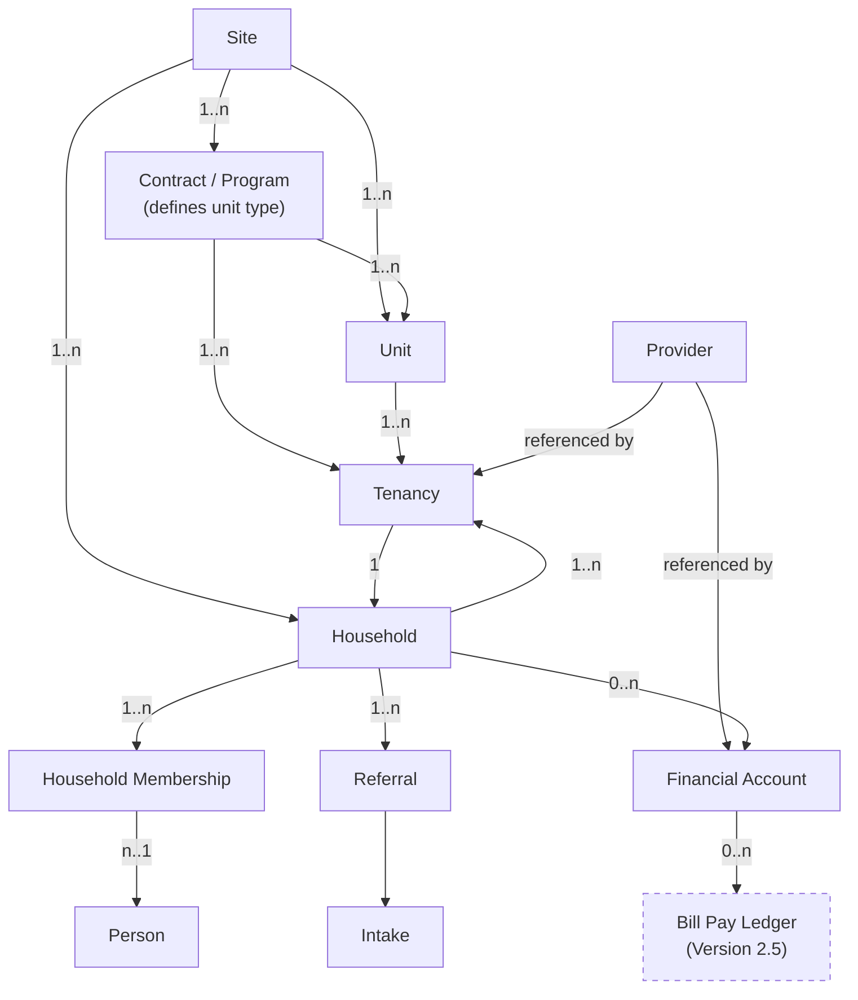

---
{"dg-publish":true,"permalink":"/10-roadmap/","dgShowToc":true}
---

# Development Roadmap

**UP Clearview, Feature and Enhancement Planning**  
**Last Updated:** October 24, 2025

This version updates timing and phase structure. Work resumes in a two-week execution window that opens as early as November 10, 2025. Earliest deployment to 1–2 sites is November 24, 2025.

---

## Timeline Overview

```
Now → Nov 10: No work
~Nov 10 → Nov 22: Phase 1, Critical Path (pilot‑ready) — two-week window opens as early as Nov 10
Nov 24: Initial deployment window opens for 1–2 sites
Nov 24 → ~Dec 9: Combined Pilot + Refinement loop
~Dec 10 → Ongoing: Broader Rollout
6+ months: Future Enhancements
```

**Earliest Execution Window:** Two-week build window opening as early as Monday, November 10, 2025  
**Earliest Initial Deployment:** Monday, November 24, 2025, 1–2 sites  
**Broader Rollout Window:** Begins about one month in, around December 10, 2025 (enhanced original release)  
**UI Upgrades:** Hold for production launch milestone

---

## Phase 1: Critical Path, Must Do Before Pilot

**Goal:** Clear deployment blockers to reach pilot‑ready build.  
**Window:** Nov 10 → Nov 22  
**Effort Estimate:** 13–20 hours

### 1.1 IntakeScreen Form Implementation

**Priority:** CRITICAL  
**Effort:** 6–8 hours  
**Assigned:** TBD

**Tasks:**

- Design form fields and layout.
    
- Build form with data cards.
    
- Add conditional field visibility by unit type.
    
- Implement OnSuccess handler.
    
- Add validation.
    
- Test end‑to‑end workflow.
    

**Acceptance Criteria:**

- Form displays all required fields.
    
- Conditional fields show and hide correctly.
    
- Form saves and updates referral status.
    
- Intake date recorded.
    
- User receives success notification.
    

**Blocks:** Intake workflow, applicant progression.

---

### 1.2 Household Members Implementation

**Priority:** CRITICAL  
**Effort:** 4–6 hours  
**Assigned:** TBD

**Tasks:**

- Create Household Members SharePoint list.
    
- Design fields: Associated Resident, Relationship, DOB, Notes.
    
- Build gallery on `scrResidentAssociations`.
    
- Add create and edit form.
    
- Add delete functionality.
    
- Test CRUD operations.
    

**Acceptance Criteria:**

- View household members for a resident.
    
- Add, edit, and remove household members.
    
- Data persists correctly.
    

**Blocks:** Household composition tracking, HMIS compliance.

---

### 1.3 Convert to Resident Validation

**Priority:** HIGH  
**Effort:** 1–2 hours  
**Assigned:** TBD

**Tasks:**

- Create complete test referral.
    
- Execute conversion workflow.
    
- Verify field transfers, including lookups.
    
- Verify unit update and navigation.
    
- Document and fix issues.
    

**Acceptance Criteria:**

- All referral data transfers to resident record.
    
- Unit assignment works.
    
- Referral removed after conversion.
    
- No data loss or corruption.
    

**Blocks:** Applicant‑to‑resident progression.

---

### 1.4 OnSuccess Handlers

**Priority:** HIGH  
**Effort:** 1–2 hours  
**Assigned:** TBD

**Tasks:**

- Add OnSuccess to `RNAInfoScreen` `Form1`.
    
- Add OnSuccess to `UnitInfoScreen` `Form1`.
    
- Confirm notifications.
    
- Verify data refresh after save.
    

**Acceptance Criteria:**

- Success notification after save.
    
- Automatic refresh.
    
- Form reflects latest data.
    

**Blocks:** None.

---

### 1.5 Password Field Removal

**Priority:** HIGH, Security  
**Effort:** 1–2 hours  
**Assigned:** TBD

**Tasks:**

- Remove Password field from Account Information list.
    
- Remove password data card from `scrResidentAccounts`.
    
- Update documentation.
    
- Notify users and recommend browser password managers.
    

**Acceptance Criteria:**

- Password field removed from SharePoint and app forms.
    
- Docs updated and users informed.
    

**Blocks:** Security compliance.

---

**Phase 1 Output:** Pilot‑ready build by Nov 22 for possible deployment Nov 24.

---

## Phase 2/3: Combined Pilot and Refinement Loop

**Goal:** Validate with real users and iterate quickly in the same window.  
**Window:** Nov 24 → ~Dec 9  
**Sites:** 1–2 small sites, 6–10 units each

### Activities

- Deploy to pilot sites on or after Nov 24.
- Train coordinators, monitor usage.
- Weekly feedback collection.
- Fix critical issues as they arise.
- Implement prioritized enhancements during the same window.
- Complete advanced reporting & analytics deliverable needed for rollout reporting.
- Run ETO integration (Release 1.2) through active testing so it is rollout-ready.
- Maintain change log and quick release notes.

### Success Metrics

- Coordinators complete all workflows without workarounds.
- Data accuracy maintained.
- Measured time savings vs spreadsheets.
- User satisfaction survey results.
- Issue frequency and severity tracked.
- ETO integration validated end-to-end against acceptance scenarios.

**Deliverable:** Pilot report with prioritized enhancements, green‑light for broader rollout.

**Note on UI:** Hold major UI upgrades for production launch. Limit this loop to functional fixes, minor UX polish, and stability.

---

## Release 1.1 / 1.2 Enhancements (Pre-Rollout)

**Goal:** Finalize the “enhanced original” release that will power the broader rollout.  
**Window:** Overlaps Phase 2/3 (target completion by ~Dec 10, 2025).

### Required Items

- **Advanced Reporting & Analytics** — Build the reporting datasets and visuals required for leadership and site metrics before expansion.
- **ETO Integration (Release 1.2)** — Deliver SharePoint ↔ ETO sync, complete active testing during the pilot window, and promote to production before broader rollout begins.

### Nice-to-Have (Time Permitting)

- **Service Provider Inline Creation** — Reduce admin friction during pilot feedback cycle if capacity allows.

**Output:** Confirmed features, docs, and training adjustments that will ship with the broader rollout package.

---

## Phase 4: Upper Post Production Rollout

**Goal:** Stabilize and scale the enhanced original build across Upper Post.  
**Start:** ~Dec 10, 2025  
**Cadence:**

- Weeks 1–2: Finalize training, perform go-live readiness checks with Upper Post staff.
- Weeks 3–6: Expand to remaining Upper Post units/programs, incorporate pilot feedback fixes.
- Ongoing: Monitor metrics, prep knowledge transfer for Version 2 schema team.

### Training and Support

- Coordinator training sessions and office hours focused on Upper Post scenarios.
- Quick reference guides tailored to Upper Post workflows.
- Ongoing bug fix support and stabilization sprints.

**Deliverable:** Application live across Upper Post with telemetry feeding Version 2 planning.

---

## Production Launch Milestone

**Scope:**

- Major user interface upgrades and visual refresh.
    
- Finalized documentation and training materials.
    
- Comprehensive regression test.
    

**Timing:** Align with first stable wave of broader rollout, post‑pilot, not earlier than mid‑December 2025. Exact date driven by pilot outcomes and stability.

---

## Future Enhancements, 6+ Months

Lower priority, after stable rollout and production launch.

### 5.1 Phone Screening Enhancements

**Priority:** MEDIUM  
**Effort:** 2–4 hours after investigation

### 5.2 Automated Notifications

**Priority:** LOW  
**Effort:** 6–10 hours

---

## Version 2: Multi-Site Schema Kickoff

**Goal:** Design and implement the multi-site compatible schema and enhanced application ahead of broader expansion.  
**Timeline Targets:**  
- **Immediate (Dec 2025):** Spin up schema redesign workstream as soon as Upper Post launch stabilizes.  
- **Early Jan 2026:** Version 2 engineering in full swing (data model implementation + migration tooling).  
- **April 2026:** Target launch of Version 2 for Upper Post with multi-site scaffolding complete and ready to onboard the next campus.

### Workstreams

- **Schema Redesign (Core):** Build the normalized entity model below, refactor Power Apps/Flows, and script migrations from v0.85 lists.
- **Migration & Data Quality:** Map existing Upper Post records into the new tables, ensuring tenancy/membership history is preserved.
- **Feature Parity + Enhancements:** Port current functionality, integrate advanced analytics, finalize ETO integration within the new model.
- **Upper Post Feedback Loop:** Keep “enhanced original” fixes flowing into the new branch so Version 2 ships with real-world improvements baked in.

### Version 2 Entity Model (Concept)



**Design Notes:**
- **Occupancy Derived:** A unit is considered occupied when a Tenancy row exists with a blank `LeaseEnd`.
- **Household Membership:** Effective-dated membership captures changing heads of household without rewriting history.
- **Contracts Drive Eligibility:** Contracts (or program types) encapsulate subsidy rules and unit-type metadata; Units and Tenancies reference the active contract instead of a separate subsidy table.
- **Financial Accounts Mandatory:** Track ledgers for each household (or person if needed) within Version 2 to support Housing Support billing, reimbursements, and tenant payments.
- **Site Scoping:** Every operational entity (Unit, Household, Contract, Tenancy, Referral, Intake, Financial Account) references Site to keep cross-campus data isolated.
- **Bill Pay Ledger:** Reserved for Version 2.5, when bulk housing-support correspondence and payment batching are ready to implement.

---

## Looking Ahead: Multi-Site Ready Release

Use the Version 2 workstreams to capture requirements from other campuses, so the multi-site rollout plan can build on a proven schema, migration tooling, and reporting stack.
